# 👁️ LucidPay

**The First "Conscious" Payment Protocol on Somnia**

> **Your money just woke up.** LucidPay is a real-time payment streaming protocol powered by **Somnia Data Streams**. Unlike passive streams, our on-chain AI agent actively optimizes transactions and broadcasts its decision-making process in real-time. Transparent, instant, and alive.

  

Live - https://lucid-pay.vercel.app/

---

## 💡 The Problem
Traditional payment streaming protocols (like Sablier or Superfluid) have two major flaws:
1. **They are "Dumb":** Automation bots run blindly, often wasting gas on small updates or failing to optimize for network conditions.
2. **They are Opaque:** Users have to trust off-chain keepers without knowing *why* a stream wasn't updated or why a specific batch was chosen.
3. **High Latency:** Frontends rely on heavy RPC polling to show balance updates, creating a laggy user experience.

## ⚡ The Solution: Somnia Data Streams
LucidPay solves this by integrating **Somnia Data Streams (SDS)** to create a "Glass Box" AI architecture.

We don't just execute transactions; **we stream the AI's thoughts.**

### How we use Somnia Data Streams:
1. **Transparent AI Logging:** Every time our Intelligent Keeper wakes up, it calculates profitability, analyzes gas prices, and makes a decision (`EXECUTE` or `SKIP`). This logic is **encoded and published to a Somnia Data Stream**.
2. **Zero-Latency UI:** The frontend subscribes to these streams via WebSocket. Instead of polling the blockchain, users see the AI's activity and stream updates instantly as they happen.

---

## 🏗️ System Architecture

```mermaid
graph TD
    User[User UI] -- "Subscribes (WebSocket)" --> SDS[Somnia Data Streams]
    
    subgraph "The Conscious Loop"
        Keeper[🤖 AI Keeper Agent] -- "1. Analyzes" --> Chain[Somnia Blockchain]
        Keeper -- "2. Optimizes Batch" --> Gemini[Google Gemini AI]
        Keeper -- "3. PUBLISHES DECISION" --> SDS
        Keeper -- "4. Executes Tx (if profitable)" --> SmartContract[StreamPay.sol]
    end
    
    SmartContract -- "Emits Events" --> Chain
```



---

## 🧠 The Data Schema
We registered a custom schema on the Somnia Testnet to structure our AI's decision logs. This allows any indexer or UI to decode the agent's behavior.

**Schema Name:** `Lucidpay_Keeper_Log_v1`

**Definition:**
```solidity
uint64 timestamp, 
string decision, 
uint256 gasPrice, 
string expectedProfit, 
uint32 batchSize, 
string reason
```

**Real-world Data Stream Example:**

When the AI decides to SKIP a transaction because gas is too high:

```json
{
  "timestamp": "1732984400",
  "decision": "SKIP",
  "gasPrice": "5000000000",
  "expectedProfit": "-0.002",
  "batchSize": 15,
  "reason": "Gas spike detected. Waiting for < 3 Gwei."
}
```

This data is immutable and verifiable on the Somnia Network.

---

## 🚀 Features

### 1. 👁️ Glass Box AI Agent
The `intelligent-keeper.ts` script doesn't just run; it communicates.

- **Input:** Fetches active streams and current gas prices.
- **Process:** Uses Gemini AI to calculate the optimal batch size for maximum profit.
- **Output:** Publishes the decision to SDS before executing on-chain.

### 2. 🌊 Reactive "Live" Dashboard
Using the `@somnia-chain/streams` SDK, our frontend hooks (`useStreamData.ts`) listen for these updates.

- **No Polling:** We removed `setInterval` loops for data fetching.
- **Instant Feedback:** Users see "AI Thinking..." and "Batch Executed" notifications pushed directly from the chain.

### 3. 🗣️ Natural Language Onboarding
Create streams by typing:

*"Pay 500 STT to alice.eth over the next 2 weeks for design work"*

Our NLP engine parses the intent and formats the transaction automatically.

---

## 🛠️ Technical Stack
- **Blockchain:** Somnia Testnet (Devnet)
- **Data Layer:** Somnia Data Streams SDK (`@somnia-chain/streams`)
- **Smart Contracts:** Solidity (Hardhat/Viem)
- **AI:** Google Gemini Flash 2.5
- **Frontend:** Next.js 14, Tailwind, Framer Motion
- **Backend:** Node.js (Keeper Bot)

---

## 🏁 Getting Started

### Prerequisites
- Node.js 18+
- A Somnia Testnet Wallet (Private Key)
- Google Gemini API Key

### 1. Clone & Install
```bash
git clone https://github.com/shreshtthh/lucidpay.git
cd lucidpay
npm install
```

### 2. Environment Setup
Create a `.env` file:

```bash
NEXT_PUBLIC_LucidPay_ADDRESS=
NEXT_PUBLIC_STREAM_KEEPER_ADDRESS=	
NEXT_PUBLIC_STREAM_FACTORY_ADDRESS=
GEMINI_API_KEY=
KEEPER_PRIVATE_KEY=
LucidPay_ADDRESS=

#Somnia Data Streams
NEXT_PUBLIC_SOMNIA_NETWORK=testnet
SOMNIA_STREAMS_API_KEY=

### 3. Register Data Schemas (One-time setup)
This script uses the SDK to register the KeeperLog schema on-chain.

```bash
npm run register-schemas
```

### 4. Run the Intelligent Keeper
Start the autonomous agent. It will begin analyzing the chain and publishing thoughts to the Data Stream.

```bash
npm run keeper
```

### 5. Run the Frontend
```bash
npm run dev
```

---

## 📜 Key Files for Judges
- **scripts/register-schemas.ts:** Shows how we define and register the custom Data Stream schemas.
- **keeper/intelligent-keeper.ts:** The core logic where the AI calculates profitability and publishes to the stream using `sdk.streams.set()`.
- **hooks/useStreamData.ts:** The frontend hook that consumes the data stream to update the UI in real-time.

---

## 🔮 Future Roadmap
- **Price Oracle Streams:** Integrate Chainlink price feeds via SDS to allow streaming in USD terms (auto-converting to STT).
- **Reputation Streams:** Analyze wallet history to assign a "Trust Score" to stream recipients, publishing this score via SDS.
- **Multi-Agent Economy:** Allow multiple Keepers to compete for stream updates, creating a decentralized market of optimization agents.

---

**Built with 💙 for the Somnia Data Streams Hackathon.**
